# SA : ONE - 직원 관리 시스템

> 사장님 혼자서 끝내는 스마트 직원 관리 플랫폼  
> 출결 · 스케줄 · 급여를 하나의 시스템으로 통합 관리하는 웹 서비스

<br/>

## 📌 프로젝트 소개

**SA : ONE**은 소규모 사업장 및 매장을 운영하는 사장님들을 위한  
통합 직원 관리 시스템입니다.

직원의 출결 관리부터 근무 스케줄, 급여 계산, 문의 관리까지  
운영에 필요한 핵심 기능들을 하나의 플랫폼에서 관리할 수 있도록 구현했습니다.

또한 웹캠 기반 출근 인증과 자동 급여 계산 기능을 통해  
실제 운영 환경에서 발생할 수 있는 관리 부담을 최소화하고자 했습니다.

<br/>

## 📅 개발 기간

> 2025.09.18 ~ 2026.02.05

<br/>

## 👨‍👩‍👧‍👦 팀 소개

| 이름 | 담당 | 역할 |
|---|---|---|
| 김동완 | FullStack | OAuth2 로그인, 관리자 페이지, 문의 및 급여 기능 구현 |
| 문서현 | Backend | Local 로그인, 마이페이지, 문의함, 직원·출결 관리 구현, 문서 정리 |
| 송다빈 | Frontend | 로그인, 캘린더, 출결, 급여, 마이페이지 UI 구현 |
<br/>

# 🛠 기술 스택

## Frontend

| 기술 | 설명 |
|---|---|
| React 18 | SPA 기반 프론트엔드 개발 |
| JavaScript | 서비스 로직 구현 |
| Emotion | CSS-in-JS 스타일링 |
| Zustand | 전역 상태 관리 |
| Axios | API 통신 처리 |

<br/>

## Backend

| 기술 | 설명 |
|---|---|
| Spring Boot | REST API 서버 개발 |
| Java 21 | 백엔드 비즈니스 로직 구현 |
| MyBatis | SQL Mapper |
| MySQL 8.0 | 데이터베이스 |
| JWT | 인증 및 인가 처리 |
| OAuth2 | 소셜 로그인 |

<br/>

## DevOps & Collaboration

| 기술 | 설명 |
|---|---|
| Git / GitHub | 형상 관리 |
| GitHub Actions | CI/CD |
| Notion | 일정 및 문서 협업 |
| Discord | 팀 커뮤니케이션 |

<br/>

# ✨ 주요 기능

## 🔐 인증 및 회원 관리

### 주요 기능
- 일반(Local) 회원가입 및 로그인
- OAuth2 소셜 로그인 지원
- 역할 기반 로그인 처리
  - 사장
  - 직원
  - 관리자

### 구현 내용
- JWT 기반 인증 처리
- Access Token 자동 저장 및 인증 유지
- Axios Interceptor 기반 토큰 자동 주입
- 정규표현식 기반 입력값 유효성 검사
- 회원가입 후 자동 로그인 처리

---

## 👤 마이페이지

### 주요 기능
- 사용자 정보 조회 및 수정
- 프로필 이미지 변경
- 비밀번호 변경
- 회원 탈퇴

### 구현 내용
- 사용자 권한별 UI 분기
- 매장 정보 연동
- 이메일 인증 기반 비밀번호 재설정
- 계정 비활성화 기반 회원 탈퇴 처리

---

## 🏪 매장 및 직원 관리

### 주요 기능
- 매장 등록 신청
- 매장 승인 / 반려
- 직원 등록 및 삭제
- 직원 목록 조회

### 구현 내용
- 매장 승인 시 Store 자동 생성
- 직원 Soft Delete 처리
- 사장 권한 검증 로직 구현
- 다중 직원 처리 구조 설계

---

## 📸 출결 관리

### 주요 기능
- 웹캠 기반 출근 인증
- 출근 및 퇴근 시간 기록
- 근무 시간 자동 계산

### 구현 내용
- 실시간 카메라 촬영 기능
- 사진 기반 출근 인증
- 중복 출근 방지 처리
- 출퇴근 시간 기반 근무 시간 계산

---

## 📅 캘린더 스케줄 관리

### 주요 기능
- 월 단위 캘린더 조회
- 근무 일정 확인
- 공휴일 자동 표시
- 근무 일정 수정

### 구현 내용
- Date-holidays 기반 공휴일 처리
- 역할 기반 캘린더 UI 분기
- 날짜별 스케줄 수정 기능
- 사장 전용 메모 기능

---

## 💰 급여 관리

### 주요 기능
- 직원별 급여 조회
- 급여명세서 관리
- 실수령액 자동 계산

### 구현 내용
- 출결 데이터 기반 급여 계산
- 수당 및 공제 자동 반영
- 세금 및 보험료 계산
- 실시간 실수령액 계산 기능

---

## 📨 문의함

### 주요 기능
- 직원 / 사장 문의 등록
- 문의 상세 조회
- 댓글 작성
- 관리자 답변 및 상태 관리

### 구현 내용
- 권한별 API 분리
- 페이징 처리
- 상태 관리 기능 구현
- 댓글 기반 문의 응답 구조 설계

<br/>

# 🧩 시스템 구조

## 👨‍💼 사장
- 매장 관리
- 직원 관리
- 급여 관리
- 스케줄 관리
- 문의 관리

## 👨‍🔧 직원
- 출퇴근 인증
- 근무 일정 조회
- 급여명세서 조회
- 문의 등록

## 🛠 관리자
- 매장 승인 / 반려
- 정책 관리
- 전체 문의 관리
- 관리자 대시보드

<br/>

# 📂 프로젝트 구조

## Frontend

```bash
src
 ┣ apis            # API 요청 관리
 ┣ assets          # 이미지 및 정적 파일
 ┣ components      # 공통 컴포넌트
 ┣ hooks           # 커스텀 훅
 ┣ pages           # 페이지 단위 화면
 ┣ react-query     # 서버 상태 관리
 ┣ routes          # 권한별 라우팅
 ┣ stores          # Zustand 전역 상태
 ┣ utils           # 공통 유틸
 ┣ App.jsx
 ┗ main.jsx
```

---

## Backend

```bash
src/main
 ┣ controller      # API 요청 처리
 ┣ service         # 비즈니스 로직
 ┣ mapper          # MyBatis Mapper
 ┣ dto             # 요청/응답 DTO
 ┣ entity          # 엔티티
 ┣ security        # JWT/Security
 ┣ exception       # 예외 처리
 ┣ util            # 공통 유틸
 ┗ resources
    ┣ mapper       # SQL XML
    ┗ application.yml
```

<br/>

# 🗄 ERD

> 사용자, 매장, 직원, 출결, 급여, 문의 데이터를 기반으로 관계형 데이터베이스를 설계했습니다.

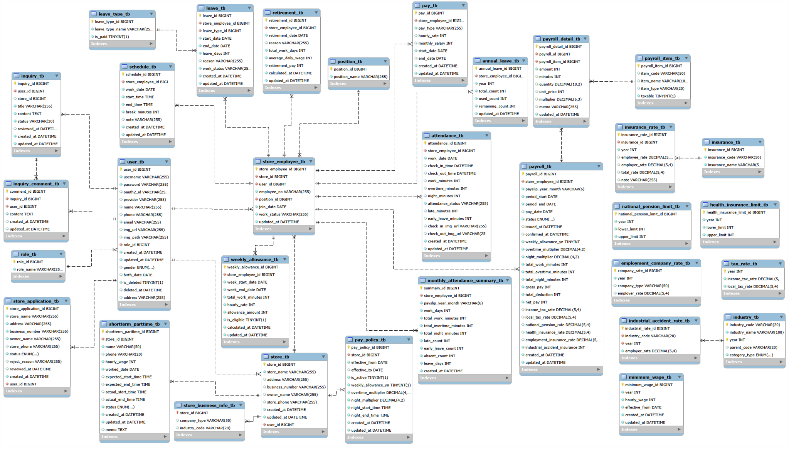

<br/>

# 🔗 API 설계

## 인증 / 계정 관리 API
- 회원가입 / 로그인
- 회원 탈퇴
- 마이페이지 조회 및 수정
- 비밀번호 재설정

## 매장 / 직원 관리 API
- 매장 등록 및 승인
- 직원 등록 / 삭제
- 직원 목록 조회

## 출결 / 캘린더 / 급여 API
- 출근 / 퇴근 처리
- 캘린더 조회
- 급여명세서 조회

## 문의 / 관리자 API
- 문의 등록 및 조회
- 관리자 댓글 및 상태 변경
- 정책 관리

<br/>

# 🚀 프로젝트 수행 과정

| 기간 | 작업 내용 |
|---|---|
| Week 0 | 기획 및 설계 |
| Week 1 | 기본 기능 개발 |
| Week 2 | 핵심 기능 개발 |
| Week 3 | 테스트 및 배포 |
| Week 4 | 발표 준비 및 마무리 |

<br/>

# 💡 프로젝트를 통해 배운 점

- 역할 기반 서비스 구조 설계 경험
- JWT 인증 및 권한 처리 이해
- 프론트엔드 · 백엔드 협업 경험
- 유지보수성을 고려한 API 설계 경험

<br/>

# 📷 주요 화면

---

# 🏠 초기 화면

## 시작 화면

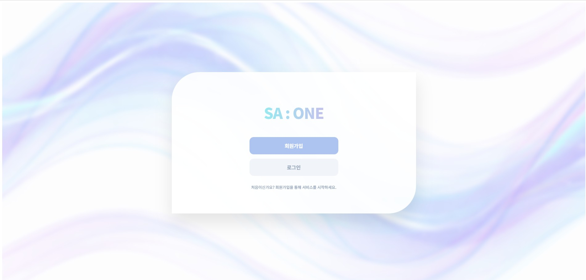

<br/>

## 메인 화면


<br/>

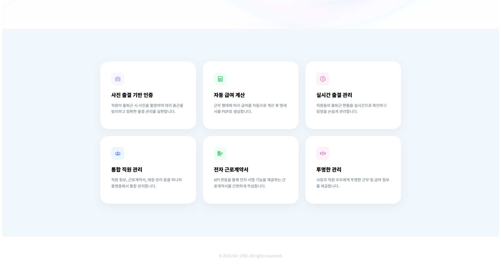

<br/>

---

# 🔐 인증 기능

## 로그인

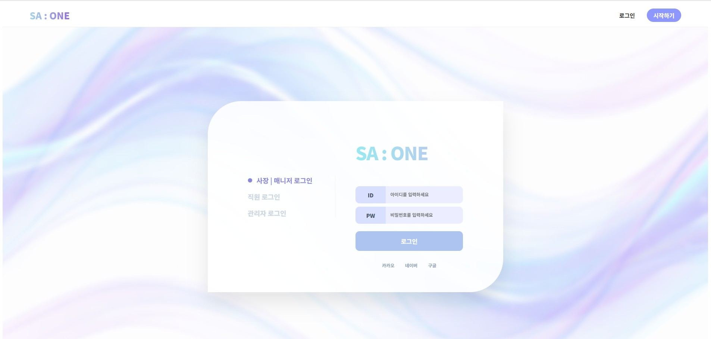

<br/>

## 회원가입

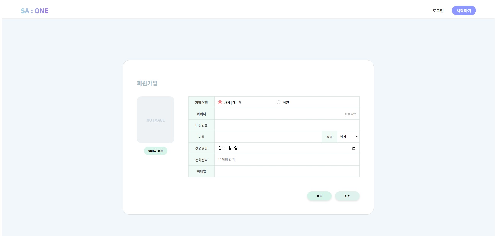

<br/>

## 비밀번호 변경

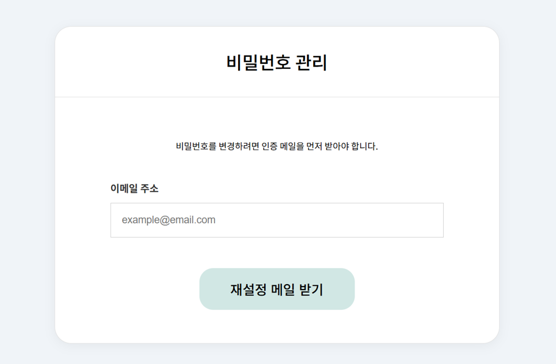

<br/>

## 회원 탈퇴

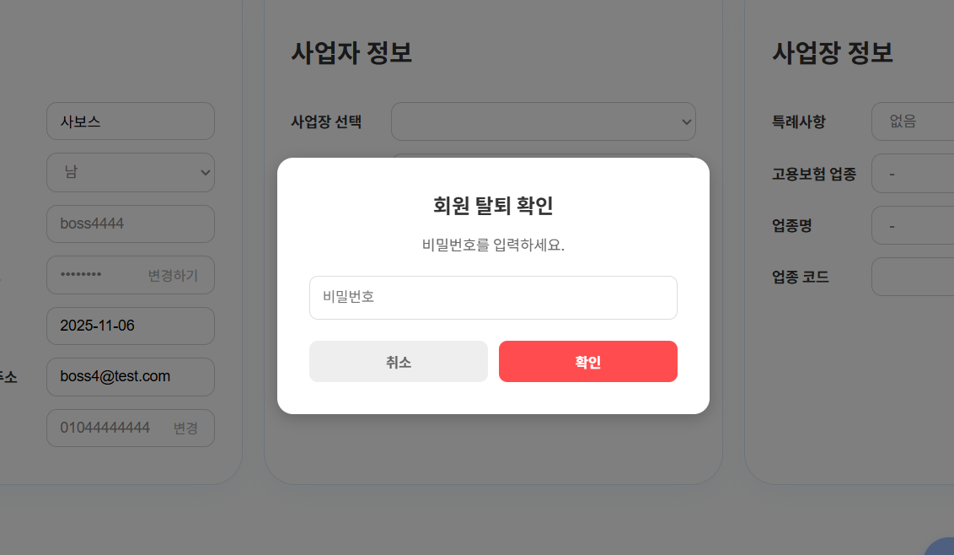

<br/>

---

# 👤 마이페이지

## 직원 마이페이지

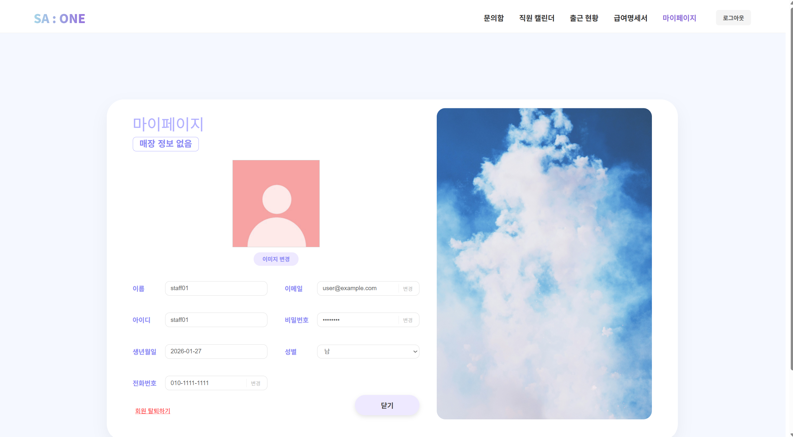

<br/>

## 사장 마이페이지

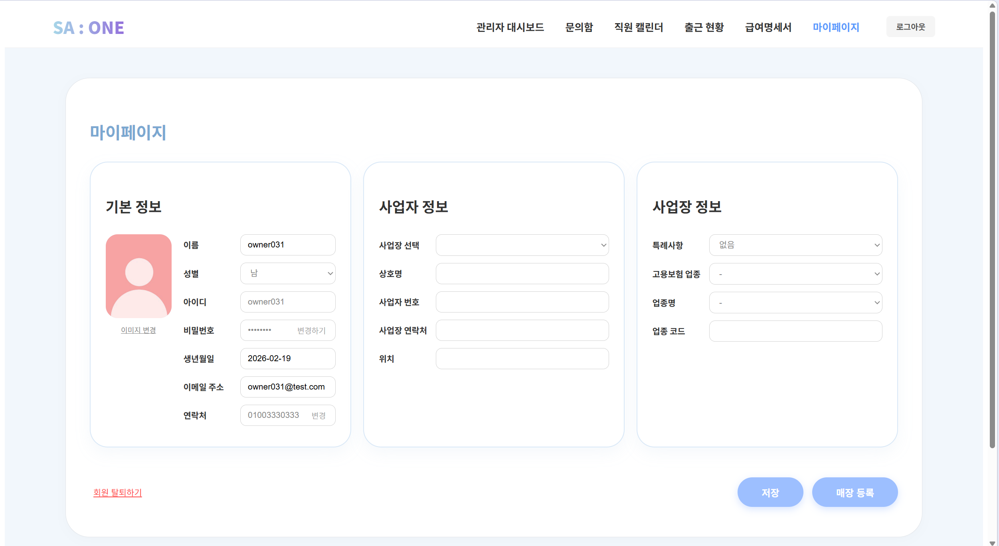

<br/>

---

# 📋 문의 관리

## 관리자 문의함

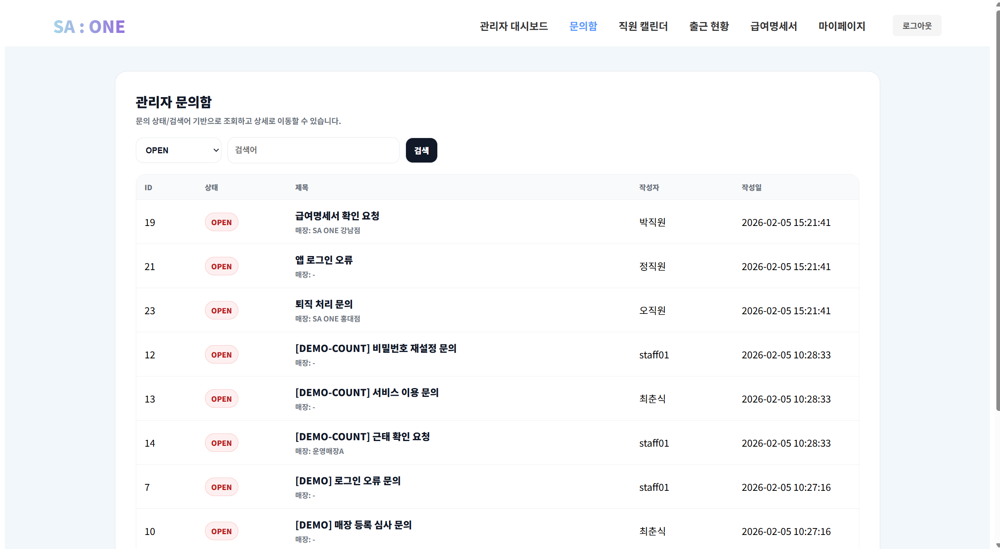

<br/>

---

# 👥 직원 관리

## 직원 등록

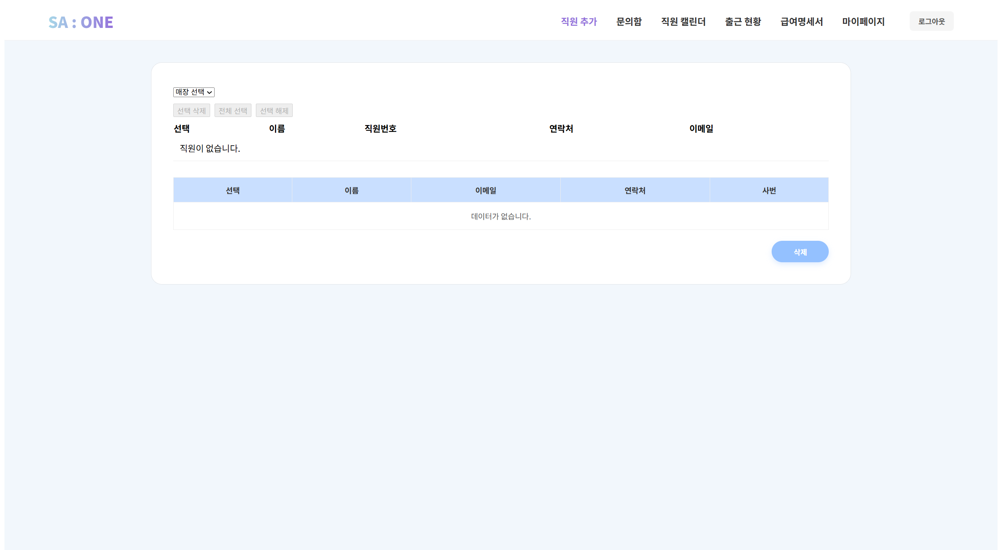

<br/>

## 직원 캘린더

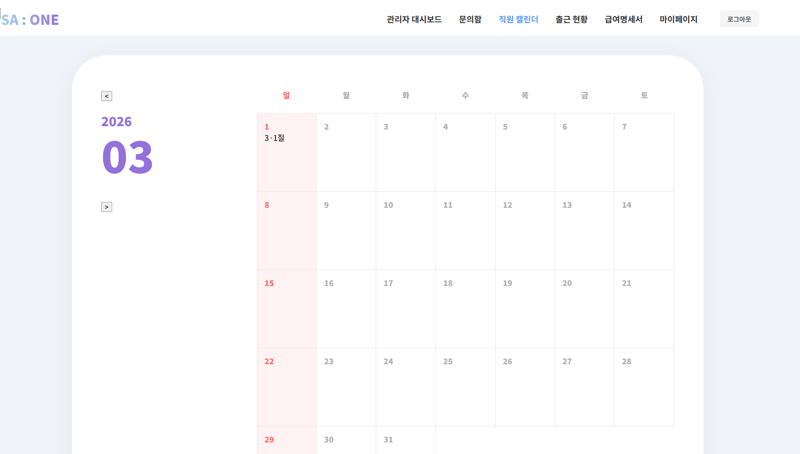

<br/>

## 사장 캘린더

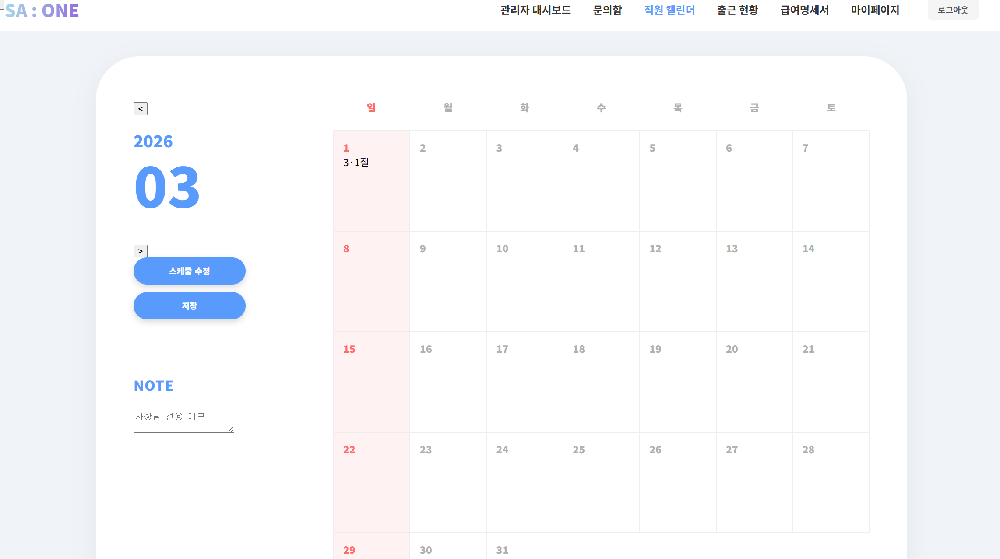

<br/>

## 캘린더 수정

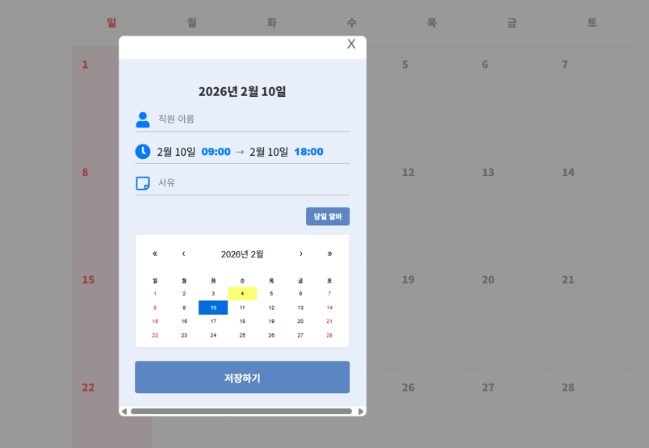

<br/>

---

# ⏰ 출결 관리

## 직원 출근 현황

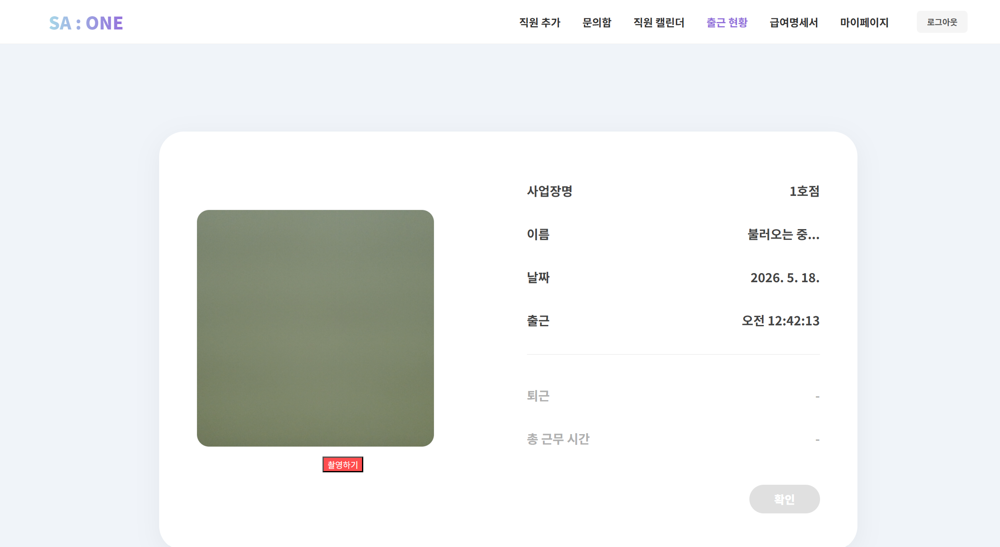

<br/>

## 사장 출근 현황

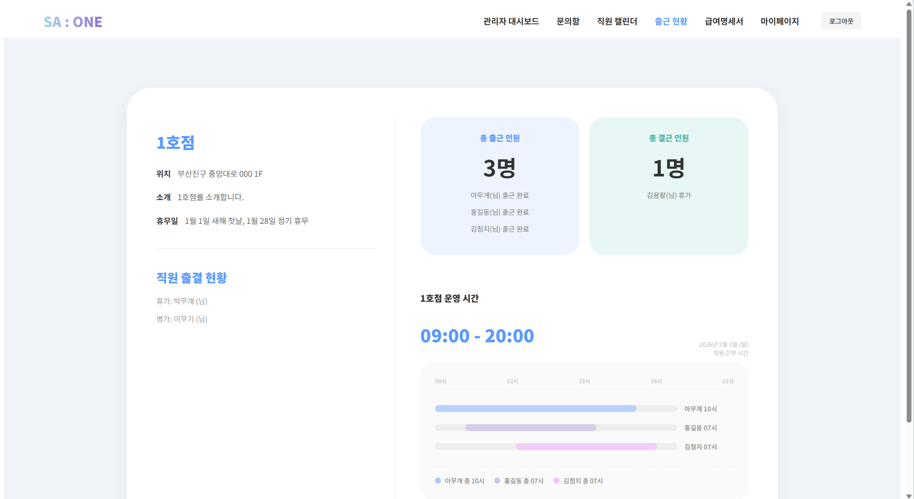

<br/>

---

# 💰 급여 관리

## 직원 급여명세서

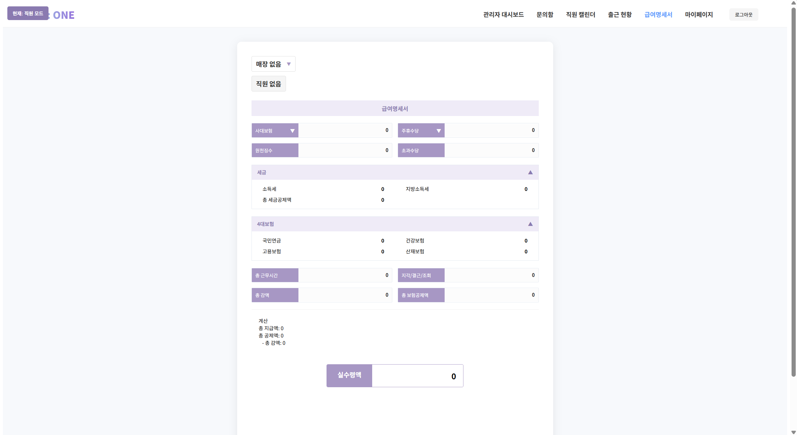

<br/>

## 사장 급여명세서

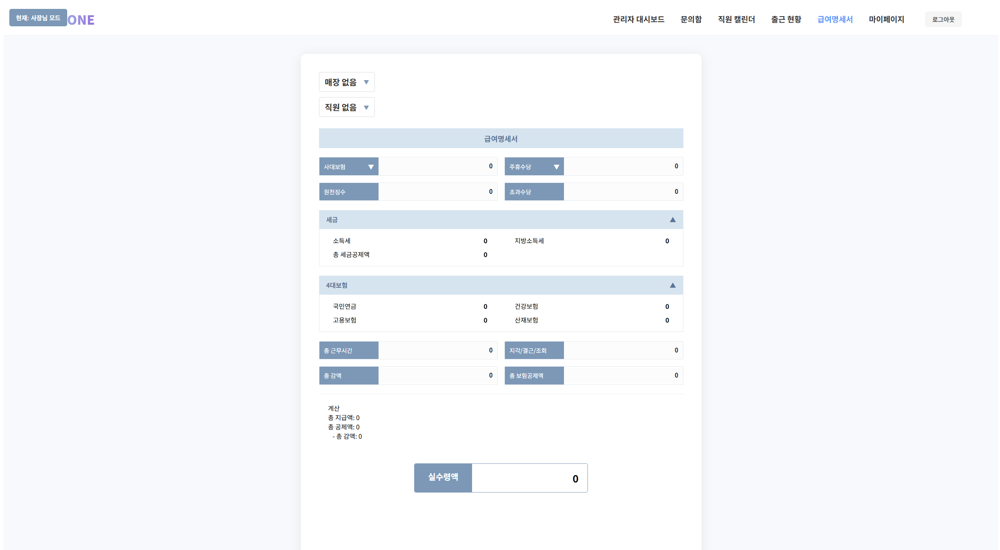

<br/>

---

# 📊 관리자 기능

## 관리자 대시보드

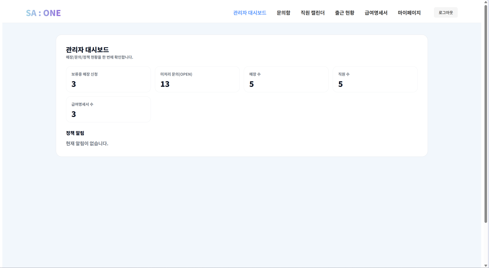

<br/>

# 📌 기대 효과

- 직원 관리 업무 자동화
- 출결 및 급여 관리 효율 향상
- 근무 일정 관리 편의성 개선
- 관리자 운영 업무 간소화
